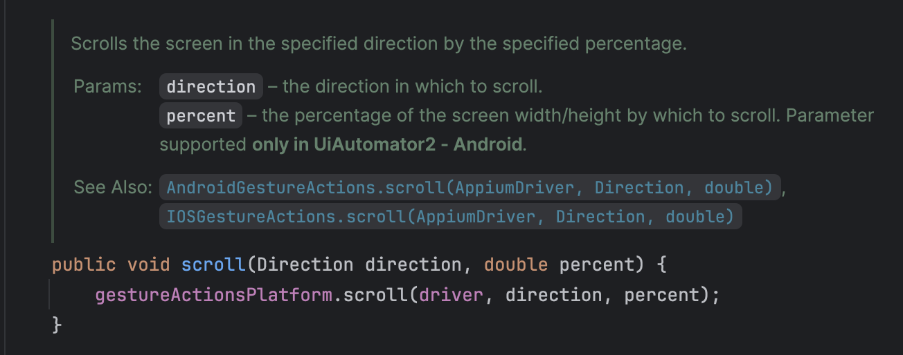
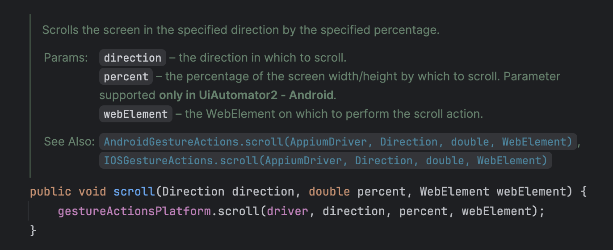
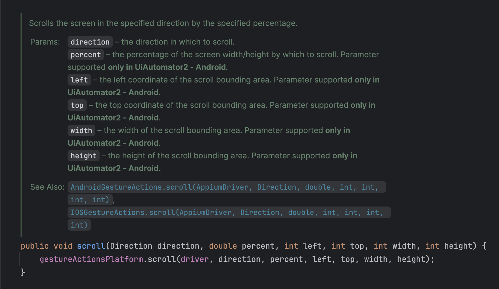

# Script Variations

Several scripts have some arguments that can be combined as they are not mandatory.

Following the example of the scroll action, it is possible to do it in a few ways:

- Just informing the **`direction`** and **`percent`** (only in **UiAutomator2**) of the screen width/height by which to scroll.

- Informing the **`direction`**, **`percent`** (only in **UiAutomator2**) and the **`webElement`** on which to perform the scroll action.

- Informing the **`direction`**, **`percent`** (only in **UiAutomator2**) and the coordinates of the area in which the scroll will be performed: **`left`**, **`top`**, **`width`** and **`height`** (only in **UiAutomator2**).

